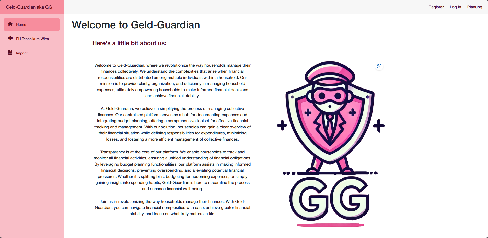
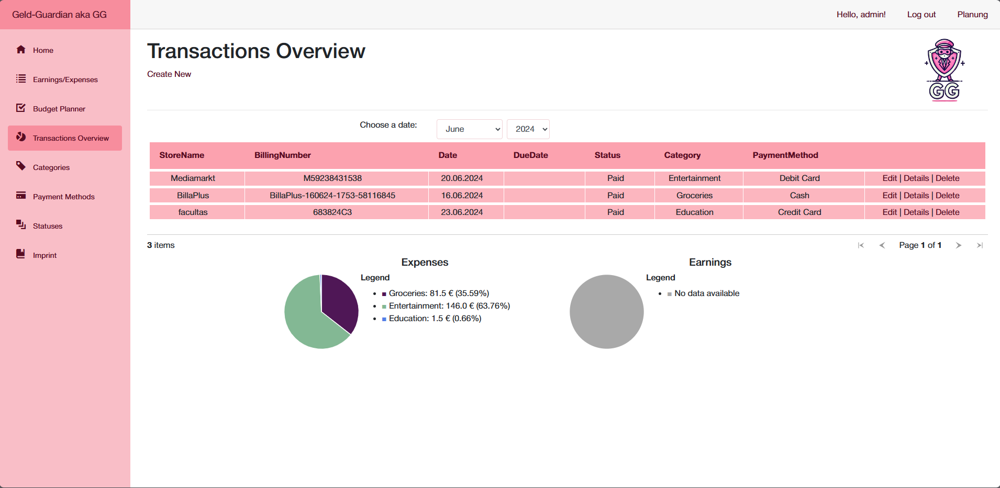
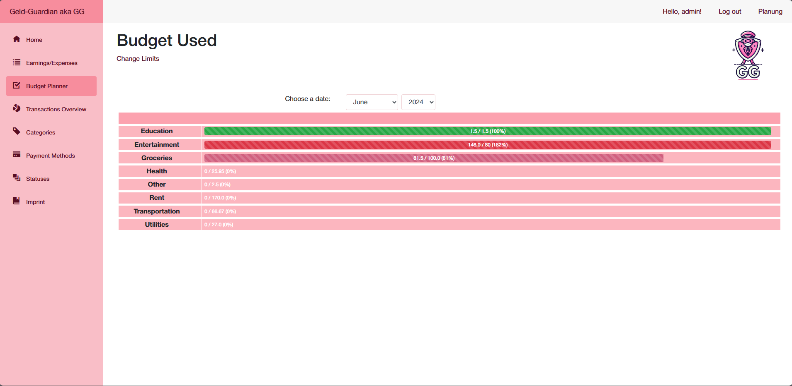

# BIF2-SS2024-ITP "Geld-Guardian"
ITP - IT Project planning

This project aims to develop a centralized financial management platform designed to streamline the process of managing household finances collaboratively. It provides a clear and concise overview of financial activities, enabling users to assign and track expenditures with ease. By incorporating budget planning capabilities, the platform assists in making informed decisions, preventing overspending, and ensuring efficient use of resources. The goal is to enhance financial transparency and responsibility among household members, leading to improved financial health and minimized losses.


## Built With

This section should list any major frameworks/libraries used to bootstrap your project. Leave any add-ons/plugins for the acknowledgements section. Here are a few examples.

Frontend

* 
* 
* 
* 

Backend
* 
* 
* 
* 

Tools used
* 
* 
* 

## Authors

- [if23b285](mailto:if23b285@technikum-wien.at) (project lead)
- [if23b100](mailto:if23b100@technikum-wien.at)
- [if23b234](mailto:if23b234@technikum-wien.at)
- [if23b254](mailto:if23b254@technikum-wien.at)
- [if23b290](mailto:if23b290@technikum-wien.at)


## Documentation

If it is still running go to geld-guardian.at and just click around.


## Deployment


```bash
  dotnet build 
```

oder Publish mit Visual Studio


## Screenshots





